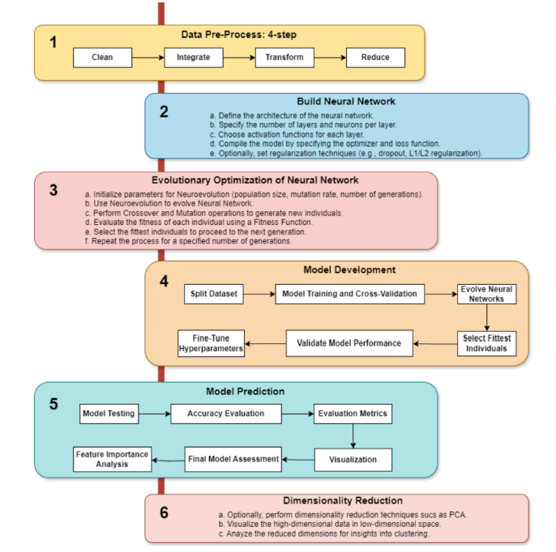

# ADNeuroNet: A Neuroevolution-Based Neural Network Algorithm for the Diagnosis of Neurodegenerative Diseases

This repository provides a research-oriented implementation of **ADNeuroNet**, 
a neuroevolution-based deep learning framework for the diagnosis of 
neurodegenerative diseases (CN / MCI / AD), as published in:

**Afreen Khan, Swaleha Zubair, Irfan Ali**  
*Neural Computing and Applications*, 2025  
📄 [Paper PDF](https://link.springer.com/content/pdf/10.1007/s00521-025-11021-y.pdf)

## Overview

ADNeuroNet is a population-based neuroevolution framework that automatically 
optimizes neural network architectures for robust clinical prediction.

Key characteristics:
- Neuroevolution instead of gradient-only optimization
- Non-invasive clinical and neuropsychological features
- Evaluation across three ADNI cohorts (ADNI-1, ADNI-2, ADNI-3)
- Focus on generalization and clinical applicability

## Methodology

  

  <em>Figure 1: ADNeuroNet framework illustrating the neuroevolution-based
  optimization pipeline for neurodegenerative disease diagnosis.</em>

The ADNeuroNet pipeline follows six stages:

1. Data preprocessing (clean, integrate, transform, reduce)
2. Neural network construction
3. Neuroevolutionary optimization
4. Model training and cross-validation
5. Performance evaluation
6. Dimensionality reduction and interpretability

The architecture corresponds to **Figure 1** in the paper.

## Results Summary

Across three ADNI datasets, ADNeuroNet achieved:

- Maximum test accuracy: **93.42%**
- Stable performance across k=5 and k=10 cross-validation
- Robust generalization across cohorts

For full experimental details, refer to Tables 5–7 in the paper.

@article{khan2025adneuronet,
  title={ADNeuroNet: A neuroevolution-based neural network algorithm for the diagnosis of neurodegenerative diseases},
  author={Khan, Afreen and Zubair, Swaleha and Ali, Irfan},
  journal={Neural Computing and Applications},
  year={2025},
  publisher={Springer}
}

